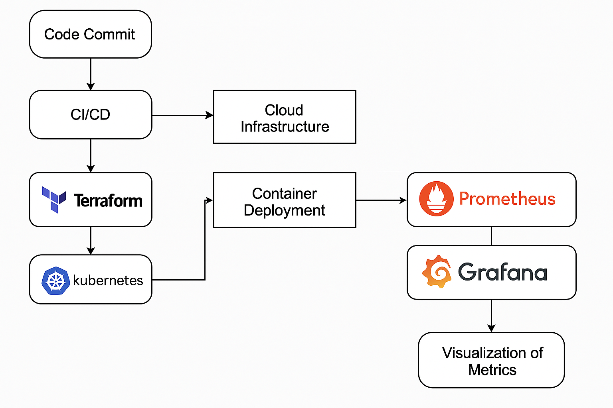

# Actividad 2: Del código a la producción: Infraestructura, contenedores, despliegue y observabilidad 

- Docente: Cesar Jesus Lara Avila  
- Integrantes:   
1. Luna Jaramillo, Christian Giovanni  
2. Mora Evangelista, Fernando Fausto  
3. Osorio Tello, Jesus Diego

Tarea teórica:

1. Infraestructura como código  
- Investigar una herramienta de IaC (p. ej. Terraform) y describir cómo organiza sus módulos. 

Terraform \- organización de módulos:  
Los módulos en Terraform son conjuntos de archivos de configuración que crean una abstracción lógica de los recursos de Terraform, las cuales se usan para la creación de recursos de infraestructura y estos se pueden administrar de diferentes maneras: configuración de dependencias, uso repositorios git y registro de terraform.

- Configuración de dependencias:

		Surge cuando un recurso depende de la existencia de otro, Terraform debe comprender el uso de estas dependencias para garantizar que los recursos de creen en el orden correcto

* Declaración implícita:  
  * Se declaran a través de referencias de expresión (Terraform analiza la expresión y automáticamente infiere la dependencia entre objetos, es decir no es necesario referenciar completamente un valor si el contexto ya lo define)

Ejemplo con declaración implícita
```
module "project_services" {
  source  = "terraform-google-modules/project-factory/google//modules/project_services"
  version = "~> 14.4"
  project_id = var.project_id
  activate_apis = [
    "bigquery.googleapis.com",
    "bigquerystorage.googleapis.com",
  ]
}
module "bigquery" {
  source       = "terraform-google-modules/bigquery/google"
  version      = "~> 5.4"

  dataset_id   = "demo_dataset"
  dataset_name = "demo_dataset"
  project_id   = module.project_services.project_id # <= implicit dependency
}
```
* A menudo tienen mayor eficiencia, limpio y fácil de mantener  
  * Declaración explícita:  
    * Se especifican mediante el metaargumento depends\_on (“especifica que Terraform debe completar todas las acciones en los objetos de los que depende un recurso o un módulo antes de continuar con el objeto dependiente”, solo es necesario si no hay una referencia directa dentro del recurso dependiente)
```
module "project_services" {
  source  = "terraform-google-modules/project-factory/google//modules/project_services"
  version = "~> 14.4"

  project_id = var.project_id
  activate_apis = [
    "bigquery.googleapis.com",
    "bigquerystorage.googleapis.com",
  ]
}

module "bigquery" {
  source       = "terraform-google-modules/bigquery/google"
  version      = "~> 5.4"

  dataset_id   = "demo_dataset"
  dataset_name = "demo_dataset"
  project_id   = var.project_id
  depends_on = [module.project_services] # <= explicit dependency
}
```
- Uso de repositorios git  
  * Guarda el código del módulo en un repositorio de Git  
  * Etiqueta el módulo con versiones mediante etiquetas Git  
- Registro de terraform  
  * Entrar al catálogo público de Terraform donde hay módulos disponibles para su uso

- ### Organización de módulos

  - Los módulos de Terraform deben seguir la [estructura de módulo estándar](https://www.terraform.io/docs/modules/create.html).  
  - Inicia cada módulo con un archivo main.tf, en el que los recursos se ubican de forma predeterminada.  
  - En cada módulo, incluye un archivo README.md en formato Markdown. En el archivo README.md, incluye la documentación básica sobre el módulo.  
  - Coloca los ejemplos en una carpeta examples/, con un subdirectorio separado para cada ejemplo. Para cada ejemplo, incluye un archivo README.md detallado.  
  - Crea grupos lógicos de recursos con sus propios archivos y nombres descriptivos, como network.tf, instances.tf o loadbalancer.tf.  
    - Evita darle a cada recurso su propio archivo. Agrupa los recursos según su propósito compartido. Por ejemplo, combina google\_dns\_managed\_zone y google\_dns\_record\_set en dns.tf.  
  - En el directorio raíz del módulo, incluye solo Terraform (\*.tf) y los archivos de metadatos del repositorio (como README.md y CHANGELOG.md).

- Proponer la estructura de archivos y directorios para un proyecto hipotético que incluye tres módulos: network, database y application. Justificar la jerarquía elegida.

Terraform\_project/  
|-- main.tf  
|-- outputs.tf  
|-- provider.tf  
|-- terraform.tf  
|-- variables.tf  
|-- terraform.tfvars  
|-- .terraform  
|&nbsp;&nbsp;&nbsp;&nbsp;&nbsp;|--modules  
|&nbsp;&nbsp;&nbsp;&nbsp;&nbsp;&nbsp;&nbsp;&nbsp;&nbsp;&nbsp;         |-- network  
|&nbsp;&nbsp;&nbsp;&nbsp;&nbsp;&nbsp;&nbsp;&nbsp;&nbsp;&nbsp;         |&nbsp;&nbsp;&nbsp;&nbsp;&nbsp;	   |-- main.tf  
|&nbsp;&nbsp;&nbsp;&nbsp;&nbsp;&nbsp;&nbsp;&nbsp;&nbsp;&nbsp;         |&nbsp;&nbsp;&nbsp;&nbsp;&nbsp;    |-- outputs.tf  
|&nbsp;&nbsp;&nbsp;&nbsp;&nbsp;&nbsp;&nbsp;&nbsp;&nbsp;&nbsp;         |&nbsp;&nbsp;&nbsp;&nbsp;&nbsp;    |-- variables.tf  
|&nbsp;&nbsp;&nbsp;&nbsp;&nbsp;&nbsp;&nbsp;&nbsp;&nbsp;&nbsp;         |&nbsp;&nbsp;&nbsp;&nbsp;&nbsp;    |-- README.md  
|&nbsp;&nbsp;&nbsp;&nbsp;&nbsp;&nbsp;&nbsp;&nbsp;&nbsp;&nbsp;         |  
|&nbsp;&nbsp;&nbsp;&nbsp;&nbsp;&nbsp;&nbsp;&nbsp;&nbsp;&nbsp;         |-- database  
|&nbsp;&nbsp;&nbsp;&nbsp;&nbsp;&nbsp;&nbsp;&nbsp;&nbsp;&nbsp;         |&nbsp;&nbsp;&nbsp;&nbsp;&nbsp;    |-- main.tf  
|&nbsp;&nbsp;&nbsp;&nbsp;&nbsp;&nbsp;&nbsp;&nbsp;&nbsp;&nbsp;         |&nbsp;&nbsp;&nbsp;&nbsp;&nbsp;    |-- outputs.tf  
|&nbsp;&nbsp;&nbsp;&nbsp;&nbsp;&nbsp;&nbsp;&nbsp;&nbsp;&nbsp;         |&nbsp;&nbsp;&nbsp;&nbsp;&nbsp;    |-- variables.tf  
|&nbsp;&nbsp;&nbsp;&nbsp;&nbsp;&nbsp;&nbsp;&nbsp;&nbsp;&nbsp;         |&nbsp;&nbsp;&nbsp;&nbsp;&nbsp;    |-- README.md  
|&nbsp;&nbsp;&nbsp;&nbsp;&nbsp;&nbsp;&nbsp;&nbsp;&nbsp;&nbsp;         |  
|&nbsp;&nbsp;&nbsp;&nbsp;&nbsp;&nbsp;&nbsp;&nbsp;&nbsp;&nbsp;         |-- application  
|&nbsp;&nbsp;&nbsp;&nbsp;&nbsp;&nbsp;&nbsp;&nbsp;&nbsp;&nbsp;         &nbsp;&nbsp;&nbsp;&nbsp;&nbsp;&nbsp;    |-- main.tf  
|&nbsp;&nbsp;&nbsp;&nbsp;&nbsp;&nbsp;&nbsp;&nbsp;&nbsp;&nbsp;         &nbsp;&nbsp;&nbsp;&nbsp;&nbsp;&nbsp;    |-- outputs.tf  
|&nbsp;&nbsp;&nbsp;&nbsp;&nbsp;&nbsp;&nbsp;&nbsp;&nbsp;&nbsp;         &nbsp;&nbsp;&nbsp;&nbsp;&nbsp;&nbsp;    |-- variables.tf  
|&nbsp;&nbsp;&nbsp;&nbsp;&nbsp;&nbsp;&nbsp;&nbsp;&nbsp;&nbsp;         &nbsp;&nbsp;&nbsp;&nbsp;&nbsp;&nbsp;    |-- README.md  
|-- .gitignore  
|-- README.md

2. Contenerización y despliegue de aplicaciones modernas  
- Describir un flujo simple de despliegue donde un desarrollador hace un cambio en el código, se construye una nueva imagen Docker y se actualiza un Deployment de Kubernetes.  
* Flujo simple  
  * El desarrollador actualiza el código y lo realiza un commit para subir la actualización  
  * Comienza el proceso CI/CD, al pasar las pruebas, se genera una nueva imagen Docker con los cambios realizados  
  * Se actualiza el deployment de Kubernetes para que apunte a la nueva imagen  
  * Kubernetes realiza el despliegue de la nueva imagen  
  * Se monitorea la aplicación con ayuda de Prometheus y Grafana, para recolectar las métricas actuales (Prometheus) y comparar con las métricas deseadas (Grafana)  
- Explicar las ventajas de usar Kubernetes para escalar una aplicación en un evento de alto tráfico.

Autoscaling:

* Pueden actualizar la carga de trabajo automáticamente, permitiendo que los clusters reaccionen a los cambios de recursos de forma las efectivo y flexible

Distribución de carga:

* Balancea automáticamente las solicitudes entre los Pods usando diferentes servicios, reduciendo así la sobrecarga de un servidor y mejorando la disponibilidad.

Seguridad:

* Por sí solo, el DNS de Kubernetes llega a fallar cuando hay un alto tráfico, pero con su complemento NodeLocal DNSCache mejora el rendimiento de DNS del cluster usando un agente de almacenamiento en caché de DNS para lograr una comunicación con los pods que se ejecutan en el mismo nodo, evitando así un seguimiento  
3. Observabilidad y Troubleshooting  
- Investigar y describir cómo Prometheus y Grafana se integran con Kubernetes para monitorear los contenedores y el cluster.  
* Prometheus: Recolecta las métricas de la aplicación, logs  
* Grafana: Dashboard que ayuda a visualizar las métricas de una manera más entendible  
- Proponer un set de métricas y alertas mínimas para una aplicación web (por ejemplo, latencia de peticiones, uso de CPU/memoria, tasa de errores).  
* Latencia de peticiones     	 –  (\>500ms)  
* Uso de CPU                   	 –  (\>75%)  
* Uso de Memoria     		 –  (\>80%)  
* Nro. de pods activados     	 –  (\>réplica)  
* Nro. de conexiones activas     –  (\<2)  
* Tasa de error     		 –  (\>5%)  
4. CI/CD (Integración continua / Despliegue continuo)  
- Explicar la diferencia entre entrega continua (continuous delivery) y despliegue continuo (continuous deployment).  
* Continuous delivery:  
  * Los cambios de código se prueban y al pasarlas entregan a fase de producción para que sean implementadas  
* Continuous deployment:  
  * Los cambios de código se prueban y al pasarlas se despliegan automáticamente

  Con esto podemos notar que la diferencia entre entrega continua y despliegue continuo, es que la entrega continua necesita la aprobación manual para empezar su despliegue, mientras que el despliegue continuo, solo necesita pasar las pruebas y luego de ello su despliegue será automático.

- Riesgos:  
  * Continuous delivery:  
    * Se reduce aún más el riesgo debido a que aún necesita una revisión final para su aprobación manual en su despliegue  
  * Continuous deployment:  
    * Requeriría un sistema de pruebas altamente confiable para su ejecución ya que en caso de alguna falla, desplegará la aplicación aún así tenga errores  
- Tiempo:  
  * Continuous delivery:  
    * Debido a que necesita una aprobación manual, el tiempo depende de qué tan rápido lo verifiquen y decidan desplegarlo  
  * Continuous deployment:  
    * No necesita una aprobación final, por lo tanto su tiempo de desarrollo es minimizado   
- Describir la relevancia de implementar pruebas automáticas (unitarias, de integración, de seguridad) dentro del pipeline.

Las pruebas aseguran que los cambios de código no introduzcan nuevos errores, mantengan la calidad del software y cumplan con los requisitos de rendimiento, seguridad y cumplimiento.

- Beneficios de pruebas automáticas dentro de un pipeline CI/CD:  
  * Detección temprana de problemas al principio del ciclo de desarrollo  
  * Reduce el riesgo de que los defectuosos lleguen a la producción  
  * Producto de software estable  
  * Aceleración en el proceso de pruebas (Versiones más frecuentes y confiables)  
- Pruebas unitarias:  
  * Validar los componentes y las funcionalidades individuales basándose en el código para verificar que funcionen según lo previsto  
  * JUnit (Java), Unidad (.NET), pytest (Python)  
- Pruebas de Integración:  
  * Verificar que los módulos o servicios de la aplicación funcionen juntos correctamente  
  * TestNG (Java), pytest (Python), JUnit (Java)  
- Pruebas de Seguridad:  
  * Permite la identificación de vulnerabilidades y se asegura de que la aplicación sea segura contra ataques  
  * OWASP ZAP, Suite Burp, SonarQube

Además de estas tres, existen más pruebas automatizadas dentro de un pipeline como la prueba de regresión (Asegura que los cambios en el código no afecte negativamente la funcionalidad existente), rendimiento (Mide el rendimiento de las aplicaciones para ver si cumplen los criterios bajo diversas condiciones) y aceptación (Verifica que la aplicación cumple los requisitos comerciales y garantiza que cumple las necesidad de la parte interesada)

4\. Evaluación y discusión final

- Trabajo colaborativo:  
  - Diseñar un flujo teórico que combine IaC (para crear recursos en la nube), despliegue de contenedores en Kubernetes y monitoreo con Prometheus/Grafana.  
* Flujo teórico:  
  * Aprovisionamiento de infraestructura con Terraform (configuración de red, creación de máquina virtual, definición de almacenamiento y configuración de los roles permitidos)  
  * Despliegue de contenedores Kubernetes (construcción de imagen Docker y configuración de CI/CD para despliegues automáticos)  
  * Configuración del monitoreo con Prometheus y Grafana (configuración de los servicios para recolección de métricas de los pods, establecimiento de métricas mínimas para verificar el estado de la aplicación)  
  - Presentar el flujo en un diagrama que incluya cada paso desde el commit hasta la visualización de métricas en tiempo real.





Recursos Adicionales:

* Reference to Named Value \- [https://developer.hashicorp.com/terraform/language/expressions/references](https://developer.hashicorp.com/terraform/language/expressions/references)  
* Estructura de un módulo en Terraform \- [https://cloud.google.com/docs/terraform/best-practices/general-style-structure?hl=es-419\#:\~:text=started%20with%20Terraform.-,Follow%20a%20standard%20module%20structure,basic%20documentation%20about%20the%20module](https://cloud.google.com/docs/terraform/best-practices/general-style-structure?hl=es-419#:~:text=started%20with%20Terraform.-,Follow%20a%20standard%20module%20structure,basic%20documentation%20about%20the%20module).  
* Administración de dependencias en Terraform \- [https://cloud.google.com/docs/terraform/best-practices/dependency-management?hl=es-419\#:\~:text=Terraform%20configuration%20dependencies%20can%20be,using%20the%20depends\_on%20meta%20argument](https://cloud.google.com/docs/terraform/best-practices/dependency-management?hl=es-419#:~:text=Terraform%20configuration%20dependencies%20can%20be,using%20the%20depends_on%20meta%20argument).  
* Terraform files: How to Structure a Terraform Project \- [https://spacelift.io/blog/terraform-files](https://spacelift.io/blog/terraform-files)  
* Descripción general de los módulos en Terraform \- [https://developer.hashicorp.com/terraform/tutorials/modules/module](https://developer.hashicorp.com/terraform/tutorials/modules/module)  
* Autoscaling Workloads in Kubernetes \- [https://kubernetes.io/docs/concepts/workloads/autoscaling/\#:\~:text=Kubernetes%20supports%20manual%20scaling%20of,resource%20definition%20of%20your%20workload](https://kubernetes.io/docs/concepts/workloads/autoscaling/#:~:text=Kubernetes%20supports%20manual%20scaling%20of,resource%20definition%20of%20your%20workload).  
* Kubernetes en entornos de alto tráfico \- [https://medium.com/upday-devs/kubernetes-on-a-high-traffic-environment-3-key-takeaways-39d3852fb515](https://medium.com/upday-devs/kubernetes-on-a-high-traffic-environment-3-key-takeaways-39d3852fb515)  
* Application Metrics \- [https://devcenter.heroku.com/articles/metrics](https://devcenter.heroku.com/articles/metrics)  
* ¿Qué es el despliegue continuo? \- [https://www.ibm.com/es-es/topics/continuous-deployment](https://www.ibm.com/es-es/topics/continuous-deployment)  
* ¿Qué es la entrega continua? \- [https://aws.amazon.com/es/devops/continuous-delivery/](https://aws.amazon.com/es/devops/continuous-delivery/)  
* Automatización de pruebas en pipelines CI/CD \- [https://es.abstracta.us/blog/crear-pipeline-automatizacion-pruebas-integracion-entrega-continua/](https://es.abstracta.us/blog/crear-pipeline-automatizacion-pruebas-integracion-entrega-continua/)  
* Pruebas y Garantía de Calidad dentro de un pipeline CI/CD \- [https://razorops.com/blog/testing-and-quality-assurance-within-a-ci-cd-pipeline](https://razorops.com/blog/testing-and-quality-assurance-within-a-ci-cd-pipeline)  
  
