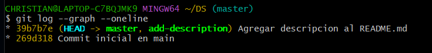
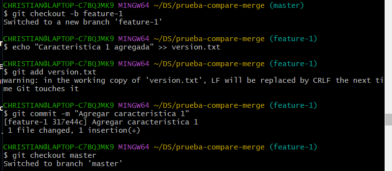

Estudiante: Luna Jaramillo, Christian Giovanni Código: 20211374B

# Ejercicios:

1.  Clona un repositorio con múltiples ramas

> Realizar la prueba de merge fast forward con dos ramas independientes

> Verificar el historial:

Pregunta: ¿En qué situaciones recomendarías evitar el uso de git merge
\--ff? Reflexiona sobre las desventajas de este método

- Según lo que tengo entendido, evitaremos su uso cuando se ha
  modificado los archivos de la rama principal luego de haber creado una
  rama ya que en ese caso se tendría que usar el merge \--no-ff o
  realizar un rebase para que la rama tambien tenga el commit que se
  hizo a la rama main

2.  Simula un flujo de trabajo en equipo

> Crear dos ramas independientes y crear un merge no fast forward
>
> Creación de la carpeta:

> Se modifica la primera rama que es la rama main

> Se crea una rama modificando el archivo ya creado pero a la vez se
> modifica el mismo archivo en la rama main, donde ambas modificaciones
> han sido comiteadas en su respectiva rama, luego se vuelve a la rama
> main y se usa merge \--no-ff para el merge no fast forward, aparecerá
> un editor para modificar el archivo y luego de aceptar los cambios se
> realizará la fusión, por errores que desconozco la parte de la
> modificación y de la fusión se eliminó de mi consola dando solo el
> resultado de la fusión y luego procedí a verificar el historial del

> En el gráfico, la parte roja indica el momento que hubo el conflicto y
> donde se abrió el editor para modificar el archivo

Pregunta: ¿Cuáles son las principales ventajas de utilizar git merge
\--no-ff en un proyecto en equipo? ¿Qué problemas podría surgir al
depender excesivamente de commits de fusión?

3.  Crea múltiples commits en una rama

> Crear ramas y fusionarlas con merge squash

> Modificación en la rama main

> Creación de una rama y modificación del archivo

> Generación de otro commit en la rama add-basic-files para mostrar el
> squash

> Se vuelve a la rama main y se hace la fusión squash

> Y para confirmar los cambios, se agrega y se hace un commit
>
> Verificamos el historial de commits

> Notamos que los dos commits hechos en la rama add-basic-files se unen
> en un solo commit en la rama main tal como en la imagen donde la rama
> tiene el commit A y commit B y la rama main tendrá un solo commit que
> será A+B

Pregunta: ¿Cuándo es recomendable utilizar una fusión squash? ¿Qué
ventajas ofrece para proyectos grandes en comparación con fusiones
estándar?

# Resolver conflictos en una fusión non-fast-forward

1.  Inicializa un nuevo repositorio

2.  Crea un archivo index.html y realiza un commit en la rama main

3.  Crea y cambia a una nueva rama feature-update

4.  Edita el archivo y realiza un commit en la rama feature-update

5.  Regresa a la rama main y realiza una edición en el mismo archivo

6.  Fusiona la rama feature-update con --no-ff y observa el conflicto

7.  Git detectará un conflicto en index.html. Abre el archivo y resuelve
    el conflicto. Elimina las líneas de conflicto generadas por Git
    (\<\<\<\<\<\<\<, =======, \>\>\>\>\>\>\>) y crea la versión final
    del archivo con ambos cambios:

8.  Agrega el archivo corregido y completa la fusión:

9.  Verifica el historial para confirmar la fusión y el commit de
    resolución de conflicto:

Preguntas:

¿Qué pasos adicionales tuviste que tomar para resolver el conflicto?

- Se usó "nano" para acceder al archivo y modificarlo manualmente

¿Qué estrategias podrías emplear para evitar conflictos en futuros
desarrollos colaborativos?

# Ejercicios: Comparar los historiales con git log después de diferentes fusiones

1.  Crea un nuevo repositorio y realiza varios commits en dos ramas:

2.  Fusiona feature-1 usando fast-forward:

3.  Fusiona feature-2 usando non-fast-forward:

4.  Realiza una nueva rama feature-3 con múltiples commits y fusionarla
    con squash:

5.  Compara el historial de Git:

    a.  Historial Fast-forward:

b.  Historial Non-fast-forward:

c.  Historial con Squash:

Preguntas:

- ¿Cómo se ve el historial en cada tipo de fusión?

  Para merge fast forward: git log \--graph \--oneline \--all

  Para merge no fast forward: git log \--graph \--oneline

  Para merge squash: git log \--graph \--oneline \--decorate \--all

  ¿Qué método prefieres en diferentes escenarios y por qué?

# Ejercicio: Usando funciones automáticas y revertir fusiones

Pasos:

1.  Inicializa un nuevo repositorio y realiza dos commits en main:

2.  Crea una nueva rama auto-merge y realiza otro commit en file.txt:

3.  Vuelve a main y realiza cambios no conflictivos en otra parte del
    archivo:

4.  Fusiona la rama auto-merge con main:

> Se fusiona mediante el comando "git merge auto-merge"

5.  Git debería fusionar los cambios automáticamente sin conflictos.

> Aparece un editor pero lo dejamos igual

6.  Revertir la fusión: Si decides que la fusión fue un error, puedes
    revertirla:

> Se revierte con el comando "git revert -m 1 HEAD"
>
> Aparece un editor pero lo dejamos igual

7.  Verifica el historial:

Preguntas:

- ¿Cuándo usarías un comando como git revert para deshacer una fusión?

  Se usaría cuando la modificación que se ha hecho presenta fallas y
  queremos volver a la versión anterior que era estable

  ¿Qué tan útil es la función de fusión automática en Git?

  Sirve para evitarnos complejidades en modificar los archivos en el
  proceso para evitar un conflicto

# Ejercicio: Fusión remota en un repositorio colaborativo

Pasos:

1.  Clona un repositorio remoto desde GitHub o crea uno nuevo:

2.  Crea una nueva rama colaboración y haz algunos cambios:

3.  Empuja los cambios a la rama remota:

4.  Simula una fusión desde la rama colaboración en la rama main de otro
    colaborador. (Puedes usar la interfaz de GitHub para crear un Pull
    Request y realizar la fusión).

> Mediante la interfaz de Github se crea un Pull Request y se verifica
> el merge de las rama con la rama main

Preguntas:

- ¿Cómo cambia la estrategia de fusión cuando colaboras con otras
  personas en un repositorio remoto?

  Varía en que primero cuando el colaborador realiza un commit y un
  push, se tiene que hacer un pull request mediante github para poder
  aplicar los cambios y realizar la fusión

  ¿Qué problemas comunes pueden surgir al integrar ramas remotas?

  Creo que un problema sería que se demora un poco más el usar la
  interfaz cada que un colaborador haga un commit y push, mientras que
  sin integrar ramas la velocidad sería mayor

# Ejercicio final: flujo de trabajo completo

Configura un proyecto simulado:

### Git merge \--ff:

- Inicializamos un repositorio para crear la rama feature 1

- Creamos un archivo README en la rama main y le hacemos un commit

- Creando una rama feature1 y modificamos el archivo README.md

- Volemos a la rama main y realizamos un git merge \--ff feature1

### Merge \--no-ff:

- Inicializamos un repositorio y creamos un archivo README.md en la rama
  main para modificarla y hacerle un commit en la misma rama

- Creamos una rama feature2, nos dirigimos a esta y modificamos el
  archivo README.md junto con su commit y volvemos a la rama main

- En la rama main ejecutamos git merge \--no-ff feature2 y nos aparecerá
  un editor donde nos pedirá explicar el mensaje si queremos, solo lo
  omitimos, salimos del editor y la fusión se habrá efectuado

### Merge squash:

- Inicializamos un repositorio y creamos un archivo README.md en la rama
  main para modificarla y hacerle un commit en la misma rama

- Creamos la rama feature3 y le realizamos dos commits al archivo
  README.md desde esa rama, al finalizar volvemos a la rama main

- En la rama main usamos merge \--squash feature3 y se hace un git
  commit al final

Analiza el historial de commits:

- Merge Fast Forwards

En historial de commits es lineal y notamos que el commit helecho en la
rama feature1, se une de manera lineal con la rama main debido a que la
rama main no ha tenido actualizaciones, en caso tenga actualizaciones
sería necesario usar un rebase en la rama feature1 para realizar la
fusión

- Merge No Fast Forwards

Podemos apreciar que se ve que no es linea, donde la rama feature2
vuelve a unirse a la rama main y genera un nuevo commit de union,
teniendo las actualizaciones que tenía en feature2, se evidenciaría
mejor su importancia si en la rama main hubiera un commit adicional y
luego se fusiona con la rama feature2, pero tal como está se puede
apreciar el arbol que generó este tipo de fusión

- Merge squash

En el historial de commits de merge squash, notamos que los dos commits
que se hicieron en feature3, se agrega en la rama main de manera lineal
en un solo commit
