### ¿Cómo te ha ayudado Git a mantener un historial claro y organizado de tus cambios?

Ayuda a tener una mejor vista y presentación de las actualizaciones que
tenemos en el archivo, tanto como la agregación de archivos .md como
.py, que con el comando \"git log \--online\" nos da de manera
organizada, una lista que todos los commit hechos para así llevar mejor
la organización del proyecto, ya que cada commit contará con una
descripción sobre que se ha hecho en ese commit

### ¿Qué beneficios ves en el uso de ramas para desarrollar nuevas características y corregir errores?

Permite modificar el código pero sin dañar el código principal, es decir
para arreglar algún problema, se crea una rama y en esta se puede
modificar el archivo con sus respectivos commits, y si se arregla el
problema, con un merge en la rama principal, unimos esa rama con la
principal, pero si no se arregla el problema, solo eliminamos esa rama y
el código no se vería afectado, sirve para la modificación \"externa\"
del archivo sin afectar la rama principal

- Ejercicio 1: Manejo avanzado de de ramas y resolución de conflictos

1.  Crear una nueva rama para una característica:

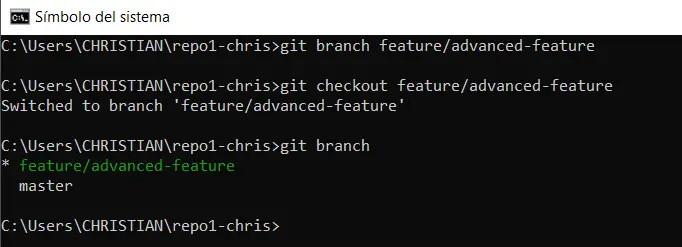

2.  Modificar archivos en la nueva rama:

    a.  Editar el archivo main.py con una función adicional: main.py de
        la rama feature/advanced-feature

> 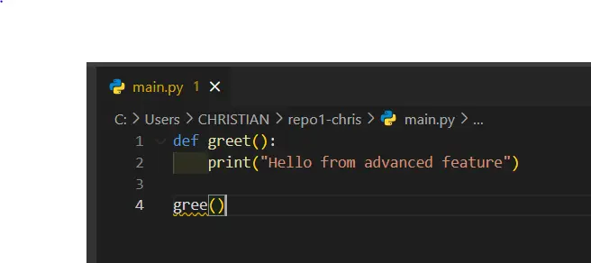

b.  Añade y confirma estos cambios en la rama feature/advanced-feature:

> 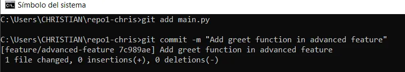

3.  Simular un desarrollo en paralelo en la rama main:

    a.  Cambiar la nueva ruta a la rama main

> 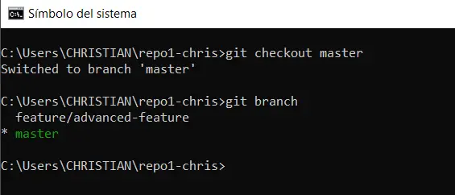

b.  Edita el archivo main.py de forma diferente: main.py de la rama main

> 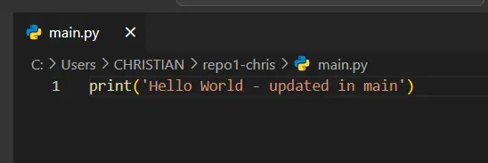

c.  Añade y confirma los cambios en la rama main

> 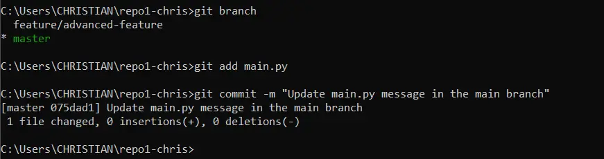

4.  Intenta fusionar la rama feature/advanced-feature en main:
    Generación de error

> 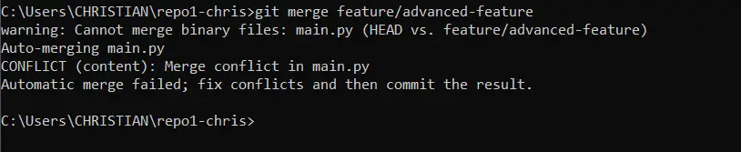

5.  Resolver el conflicto de fusión

> 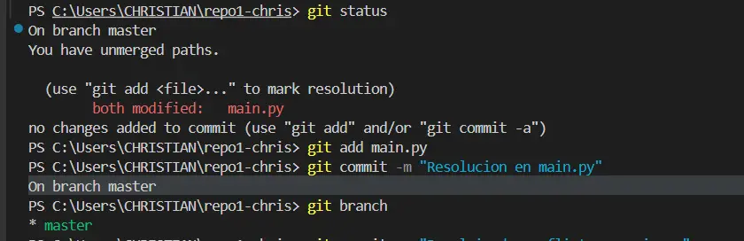

6.  Eliminar la rama fusionada

> 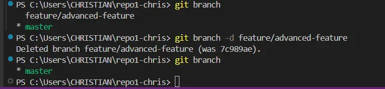

- Ejercicio 2: Exploración y manipulación del historial de commits

1.  Ver el historial detallado de commits (git log -p)

> 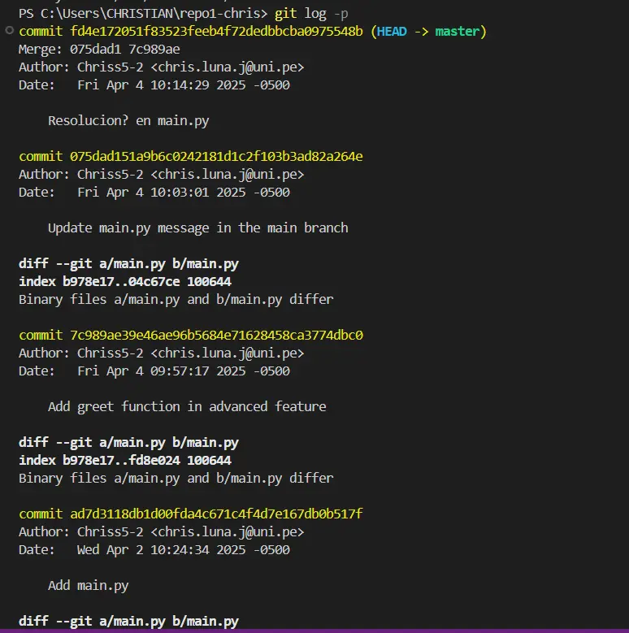

2.  Filtrar commits por autor (git log \--author="Nombre")

> 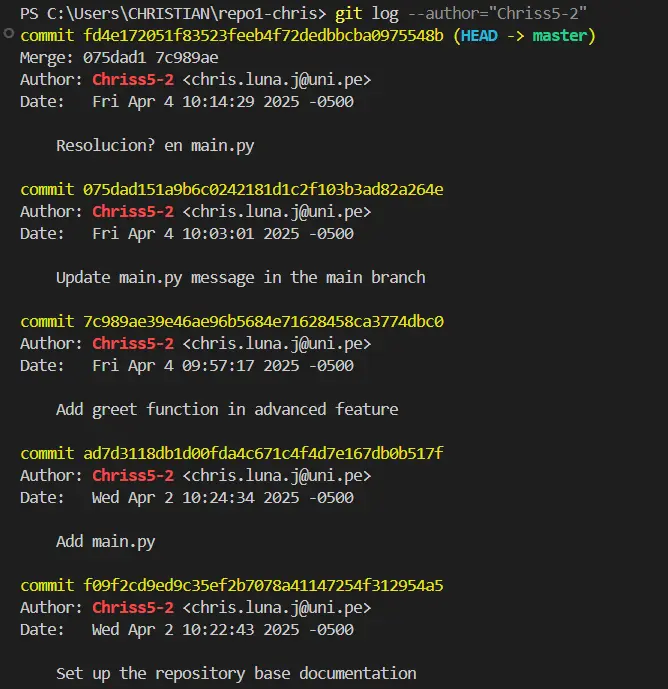

3.  Revertir un commit (git revert HEAD)

> 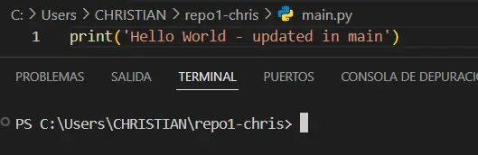
>
> 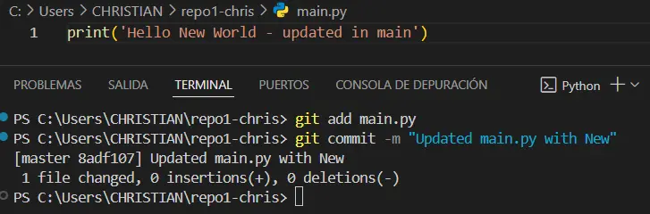
>
> luego git revert HEAD, me salió en la consola para confirmar la
> reversión, y luego de poner ESC y :wq me salió lo siguiente
>
> 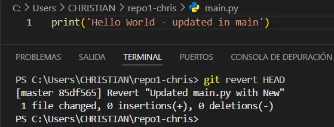

4.  Rebase Interactivo

    a.  Al usar git rebase -i HEAD\~3 aparece la siguiente consola

> 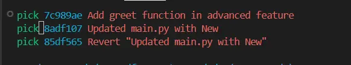

b.  Utilizamos squash para combinar los 3 últimos commits

> 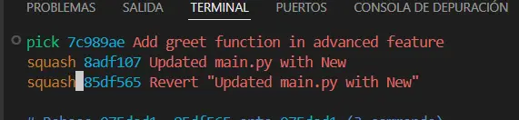

c.  Ponemos ESC y :wq y Enter para aceptar el rebase, luego si hay
    errores modificamos el archivo que da error, lo añadimos, le damos
    commit y luego con git rebase \--continua se termina el rebase

<!-- -->

5.  Visualización gráfica del historial:

> 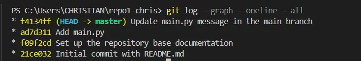

- Ejercicio 3: Creación y gestión de ramas desde commits específicos

1.  Crear una nueva rama desde un commit específico

    a.  Creando rama desde el commit f09f2cd

> 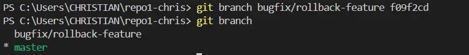
>
> El hash del commit sobre el que cree la rama, en la imagen de arriba
> se puede notar que es antes de añadir el main.py, por lo tanto si me
> ubico a esa nueva rama, el sistema me avisa que no existe el main.py
>
> 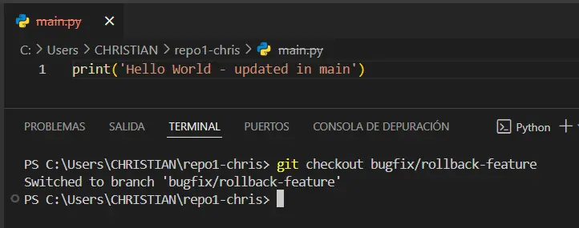
>
> podemos notar que el main.py está tachado indicando que no existe en
> esa rama, pero si vuelvo a la rama main, notamos que si existe
>
> 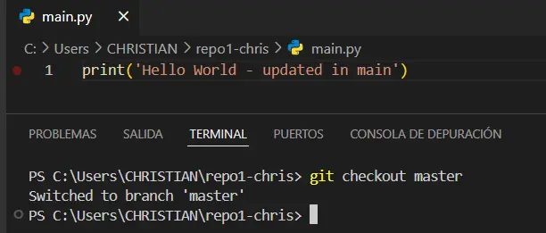
>
> Para continuar, eliminamos la nueva rama y la creamos en la dirección
> del último commit hecho, resolviendo distintos problemas, el último
> commit hecho por mi, sería c57def9 y a partir de ahí creamos la rama,
> modificamos el main y fusionamos con la rama principal

2.  Modificar y confirmar cambios en la nueva rama

3.  Fusionar los cambios en la rama principal

> 

4.  Explorar el historial después de la fusión

    a.  Con el codigo git log \--graph \--oneline se aprecia el
        historial y podemos ver la generación de una nueva rama y su
        unión generando solo una

> 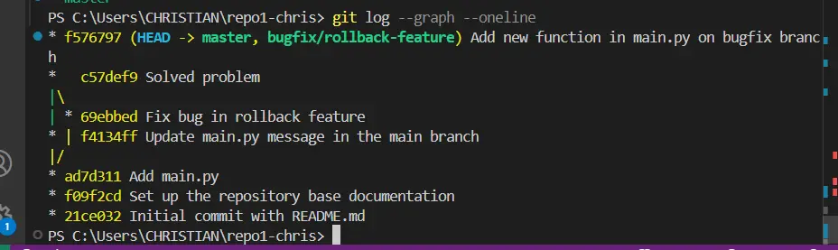

5.  Eliminar la rama bugfix/rollback-feature

- Manipulación y restauración de commits con git reset y git restore

1.  Hacer cambios en el archivo main.py y hacer commit

> 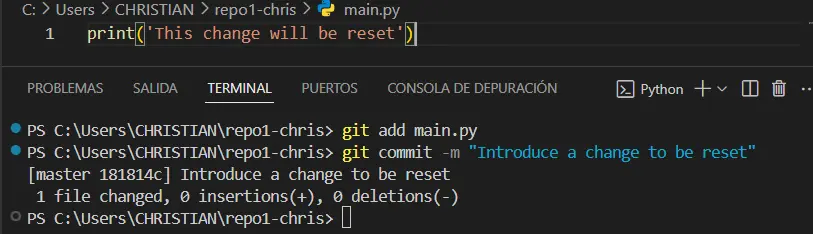

2.  Usar git reset para deshacer el commit:

    a.  Como se puede ver en la ultima figura de la sección anterior,
        nuestro ultimo commit tenía el hash f576797, así que al hacer el
        commit anterior, y al aplicar git reset \--hard HEAD\~1
        tendríamos que volver al commit con hash f576797 para verificar
        que hemos deshecho el commit de la primera parte

> 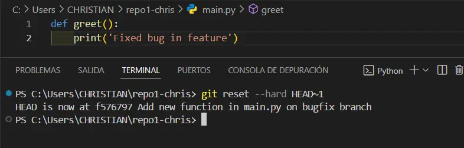

3.  Usar git restore para deshacer cambios no confirmados:

    a.  Modificamos el archivos README.md creada al comienzo de la
        actividad y al usar git status, notamos que como no hemos hecho
        un add, la modificación está sin confirmar, no está en 'stages'
        osea listo para el commit

> 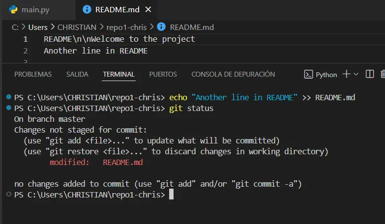

b.  Aplicamos git restore y notamos que deshace el cambio no confirmado,
    y al usar git status vemos que no hay modificación pendiente

> 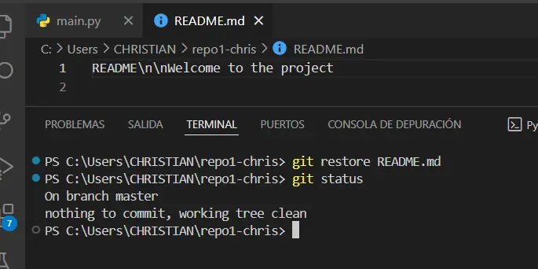

- Ejercicio 5: Trabajo colaborativo y manejo de Pull Requests

1.  Crear un nuevo repositorio remoto:

> 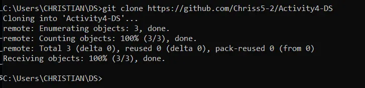

2.  Crear una nueva rama para desarrollo de una característica

> 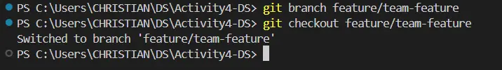

3.  Realizar cambios y enviar la rama al repositorio remoto

> 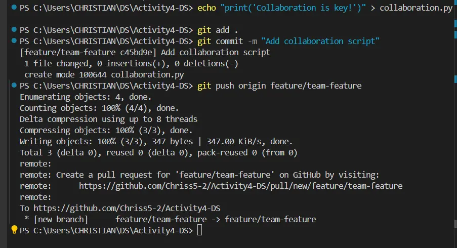
>
> y al verificar en el repositorio de github
>
> 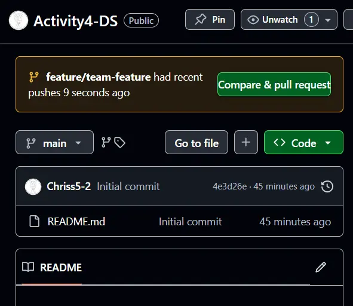

4.  Abrir un Pull Request

> 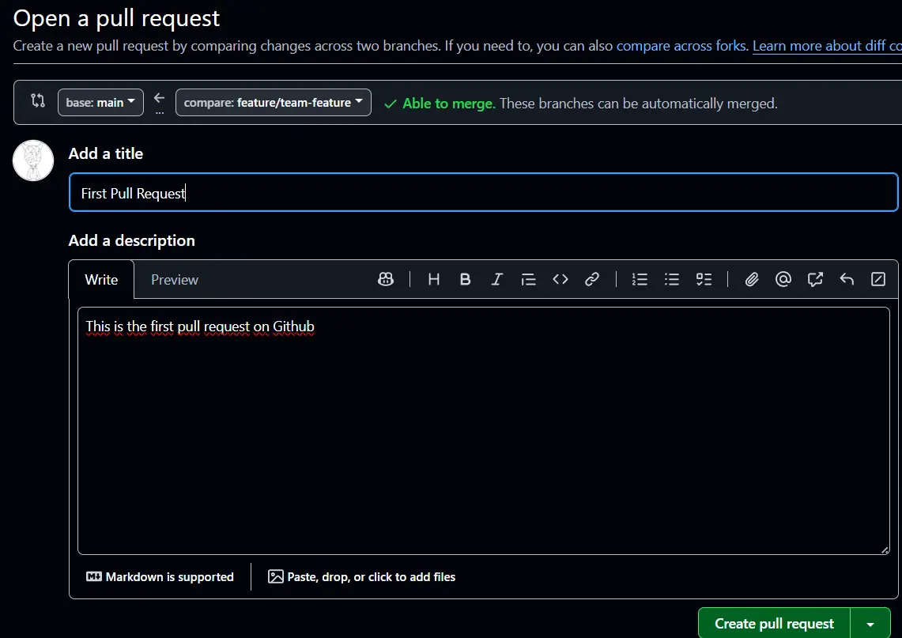

5.  Revisar y fusionar el Pull Request

> 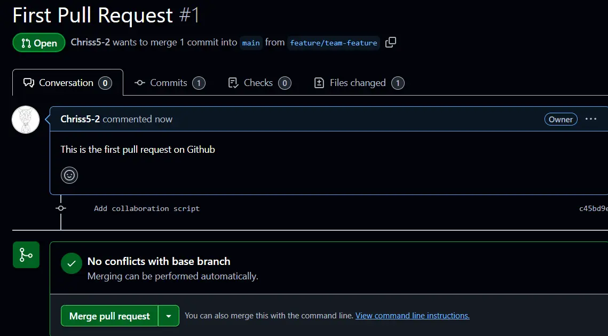
>
> Aceptamos el Merge pull request y el merge se hará valido
>
> 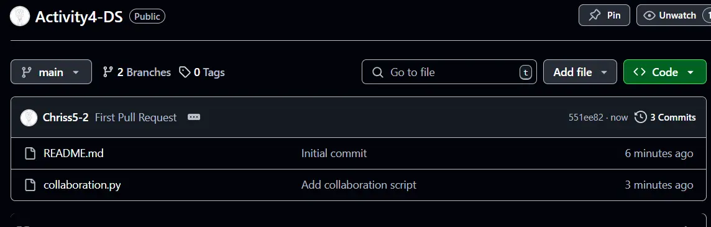

6.  Eliminar la rama remota y local

Para eliminarlo por consola, primero tenemos que hacer un pull para
actualizar los cambios hechos en github

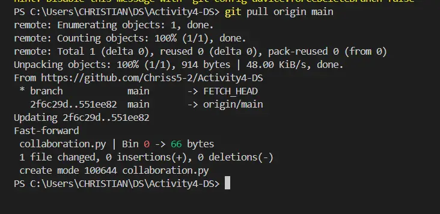

Luego procedemos a eliminar la rama

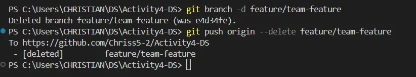

Y al verificar las ramas en github solo nos aparecerá la rama main

- Cherry Picking y Git Stash

git cherry-pick: Aplicar commits específicos a otra rama

git stash: Guardar temporalmente cambios no confirmados

1.  Hacer cambios en main.py y confirmarlos

> 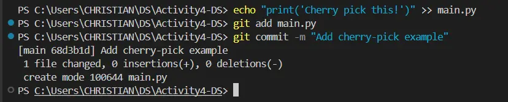

2.  Crear una nueva rama y aplicar el commit específico

    a.  Creando rama: Como queremos aplicar el mismo commit con
        cherry-pick, verificaremos el listado de commits, y generaremos
        la rama en el commit anterior al de la parte 1, porque si
        hicieramos commit en esa parte, la rama ya tendría el commit

> 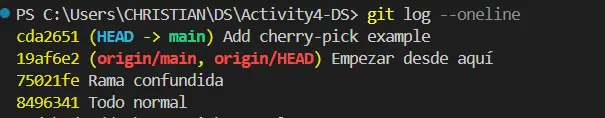
>
> 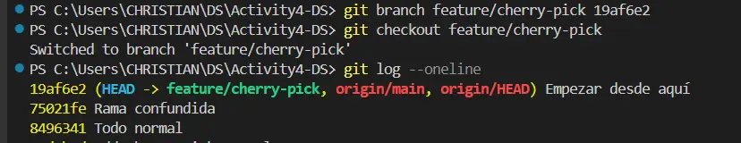

b.  Ahora para hacer el commit especifico, tomaremos el hash del ultimo
    commit de la rama main, que es cda2651

> 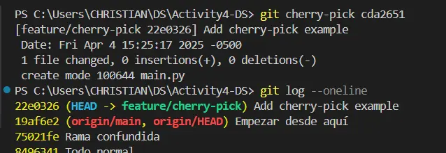

3.  Guardar temporalmente cambios no confirmados

> 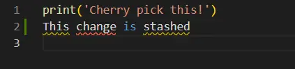
>
> 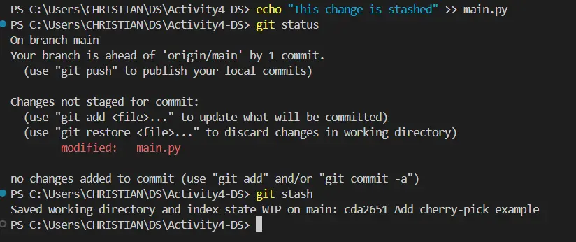
>
> Al aplicar git stash vemos que se guarda y ya no aparece en el main.py
>
> 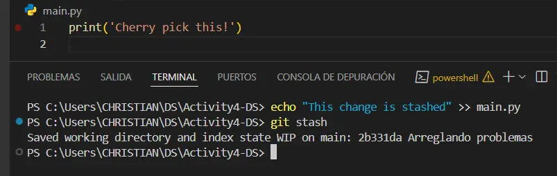

4.  Aplicar los cambios guardados

    a.  Con git stash list podemos ver la lista de stash y el primero
        que aparece es la actualización que habíamos hecho en el main.py

> 

b.  Para recuperar los cambios, lo que hacemos es git stash pop

> 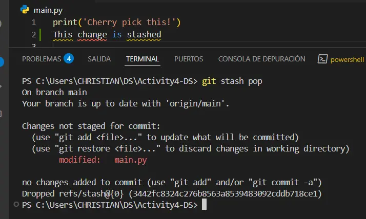
>
> También lo elimina de la lista y se guarda normal

5.  Revisar el historial y confirmar la correcta aplicación de los
    cambios

    a.  Usando git log revisamos el historial de commits y vemos que
        todo se ha aplicado correctamente

> 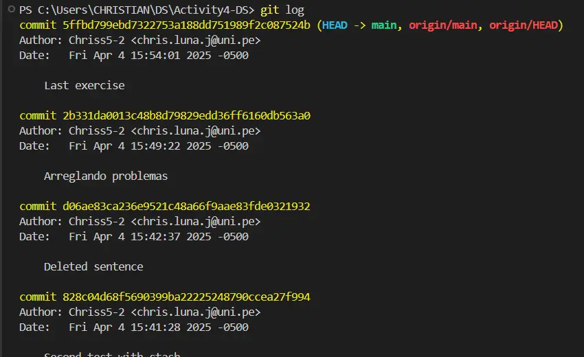
